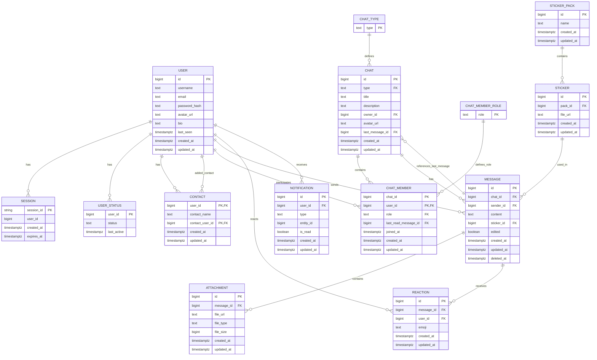

# Описание отношений БД

#### Таблица `user`
**Описание:** Хранит информацию о пользователях, включая учетные данные и профиль.

**Первичный ключ:**  
`{id}`

**Альтернативные ключи:**  
`{email}`, `{username}`

**Функциональные зависимости:**
```
{id} -> username, email, password_hash, avatar_url, bio, created_at, updated_at
{email} -> id, username, password_hash, avatar_url, bio, created_at, updated_at
{username} -> id, email, password_hash, avatar_url, bio, created_at, updated_at
```

#### Таблица `contact`
**Описание:** Хранит связи между пользователями (контакты).

**Первичный ключ:**  
```{(user_id, contact_user_id)}```

**Функциональные зависимости:**
```
{user_id, contact_user_id} -> contact_name, created_at, updated_at
```


#### Таблица `chat_type`
**Описание:** Типы чатов.

**Первичный ключ:**  
```{type}```

**Функциональные зависимости:**
```{type} -> (нет дополнительных атрибутов)```

#### Таблица `chat`
**Описание:** Хранит информацию о чатах.

**Первичный ключ:**  
```{id}```

**Функциональные зависимости:**
```
{id} -> type, title, description, owner_id, avatar_url, last_message_id, created_at, updated_at
```

#### Таблица `chat_member_role`
**Описание:** Хранит роли участников чатов.

**Первичный ключ:**  
```{role}```

#### Таблица `chat_member`
**Описание:** Связь пользователей с чатами и их роли.

**Первичный ключ:**  
```{chat_id, user_id}```

**Функциональные зависимости:**
```
{chat_id, user_id} -> role, last_read_message_id, joined_at, created_at, updated_at
```

#### Таблица `message`
**Описание:** Хранит сообщения в чатах.

**Первичный ключ:**  
```{id}```

**Функциональные зависимости:**
```
{id} -> chat_id, sender_id, content, sticker_id, edited, created_at, updated_at, deleted_at
```

#### Таблица `attachment`
**Описание:** Вложения к сообщениям.

**Первичный ключ:**  
```{id}```

**Функциональные зависимости:**
```
{id} -> message_id, file_url, file_type, file_size, created_at, updated_at
```

#### Таблица `reaction`
**Описание:** Реакции пользователей на сообщения.

**Первичный ключ:**  
```{id}```

**Функциональные зависимости:**
```
{id} -> message_id, user_id, emoji, created_at, updated_at
```

#### Таблица `sticker_pack`
**Описание:** Наборы стикеров.

**Первичный ключ:**  
```{id}```

**Функциональные зависимости:**
```
{id} -> name, created_at, updated_at
```

#### Таблица `sticker`
**Описание:** Стикеры, принадлежащие наборам.

**Первичный ключ:**  
```{id}```

**Функциональные зависимости:**
```
{id} -> pack_id, file_url, created_at, updated_at
```

#### Таблица `notification`
**Описание:** Уведомления для пользователей.

**Первичный ключ:**  
```{id}```

**Функциональные зависимости:**
```
{id} -> user_id, type, entity_id, is_read, created_at, updated_at
```

#### `session (REDIS)`
**Описание:** Сессии пользователей для аутентификации. Хранятся в Redis в виде key-value, где ключ — session_id, значение — данные о пользователе и времени жизни сессии.

**Первичный ключ:**  
```{session_id}```

**Функциональные зависимости:**
```
{session_id} -> user_id, created_at, expires_at
```
#### `user_status (REDIS)`
**Описание:** хранит текущий статус пользователя и время последней активности.

**Первичный ключ:**  
```{user_id}```

**Функциональные зависимости:**
```
{user_id} -> status, last_active
```


